# Дневник   неанонимного   трудоголика

  
 Кондаурова Мария  •  BIOCAD  •  Moscow DrinkUp  •  18.06.2026
  

---
layout: statement
---

# 🍻Слайд для пива 🍻

---
layout: statement
---

# А теперь серьезно

---
layout: section
---

# Акт 1

### Смешно, потому что знакомо

---
layout: statement
---

# Расправим плечики

### Спикер опять будет просить поднимать руки

---
layout: statement
---

# Кому хотя бы раз **снилась** работа?

---
layout: statement
---

# Кто в отпуске читает рабочие чаты?

---
layout: statement
---

# Кто открывал рабочий ноут ‘на секундочку’ — и пропадал на час/вечер?

---
layout: statement
---

# Кто брал с собой в отпуск ноутбук?

---
layout: statement
---

# Кто работает больше 8-ми часов и делает вид, что это временно?

---
layout: statement
---

# Меня зовут Маша

<v-click>

# и я — трудоголик

</v-click>

---
layout: intro-image-right
image: assets/me.jpg
---

<v-clicks>

- Руковожу разработкой интерфейсов в BIOCAD ~~и что-то понимаю в биологии~~
- Член Программного Комитета HolyJS
- Инвестирую в настольные игры и крашу Warhammer
- ...

</v-clicks>

---
layout: intro-image-right
image: assets/long.jpg
---

- Руковожу разработкой интерфейсов в BIOCAD ~~и что-то понимаю в биологии~~
- Член Программного Комитета HolyJS
- Инвестирую в настольные игры и крашу Warhammer
- Бью людей железной палкой

---
layout: statement
---

# Дисклеймер

<v-clicks>

Возможно это не про вас (и хорошо если так)

Но если про вас — задумайтесь

Спикер — не психолог и если у вас проблема, то обратитесь к специалисту

</v-clicks>

---
layout: statement
---

## Этот доклад не про “работать плохо” <v-click> (не надейтесь)</v-click>
 

<v-click>

## это доклад про “можно перегнуть”

</v-click>

---
layout: statement
---

# любовь к работе !== зло
<v-click>

### Мы бы не полетели в космос и не сделали другие классные штуки
</v-click>

---
layout: intro-image-right
image: assets/fine.png
---

трудолюбие и трудоголизм выглядят похоже снаружи, но очень по-разному ощущаются изнутри

---
layout: quote
---

# "Трудоголизм — <v-click> это внутреннее давление работать, </v-click> <v-click> навязчивые мысли о работе, </v-click> <v-click>негативные эмоции без работы </v-click> <v-click> и работа сверх того, что реально требуется."</v-click>

<v-click>(Саммари многих определений трудоголизма)</v-click>

---
layout: statement
---

# Звучит похоже на карьерный трек

---
layout: section
---

# Акт 2

### Почему именно мы и немного науки

---
layout: statement
---

## Вброс:

<v-click>

## В айтишной культуре переработка 
## === 
## талант и ответственность 

</v-click>

---

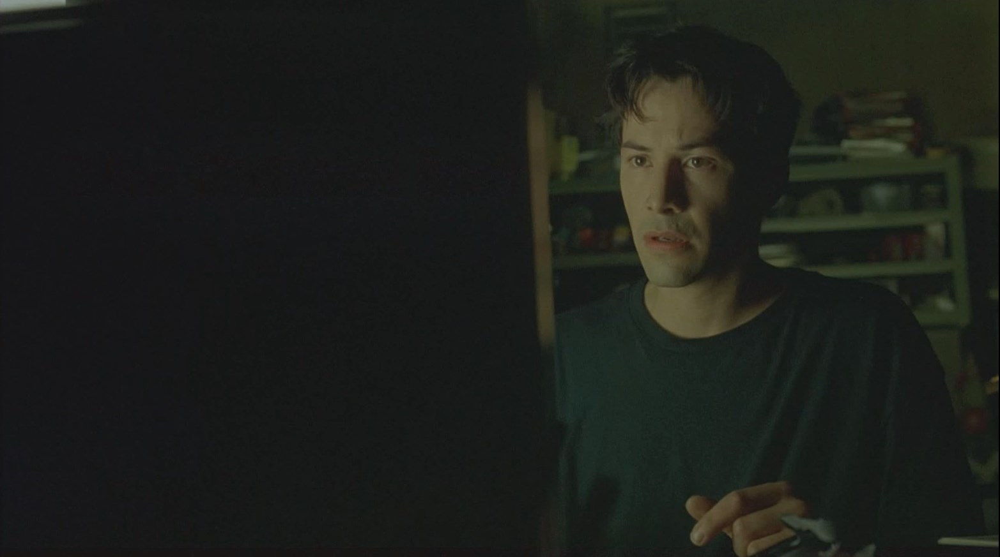
<i>Фильм "Матрица" (1999)</i>

---

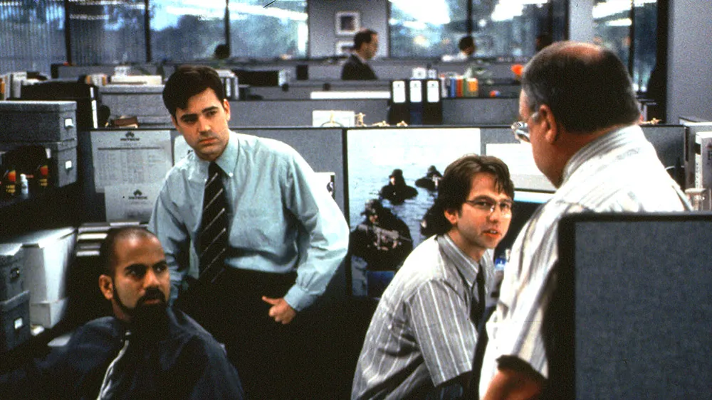
<i>Фильм "Office Space" (1999)</i>

---

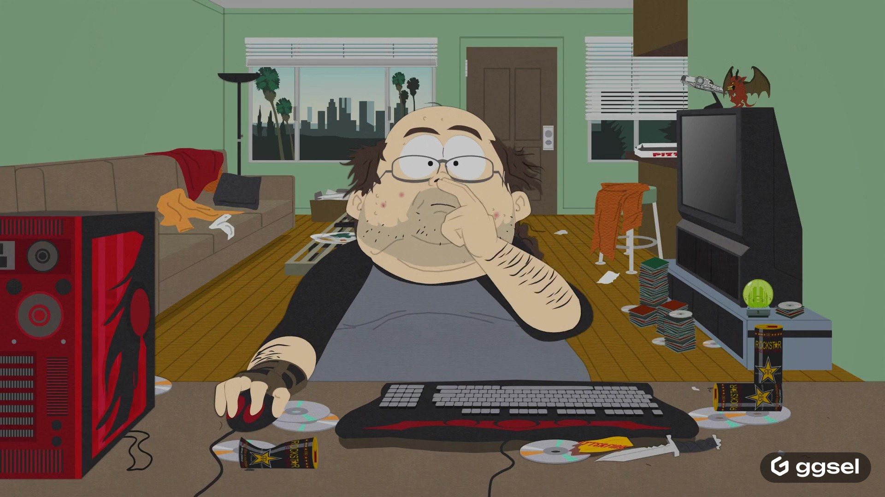
<i>Южный парк, эпизод "Make love, not Warcraft" (2004)</i>

---

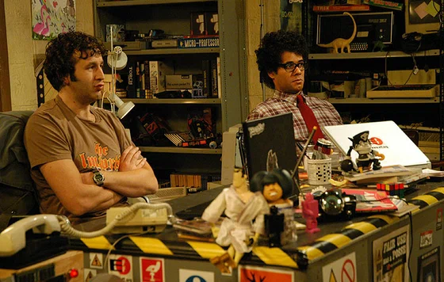
<i>Сериал "Компьютерщики" (2006)</i>

---

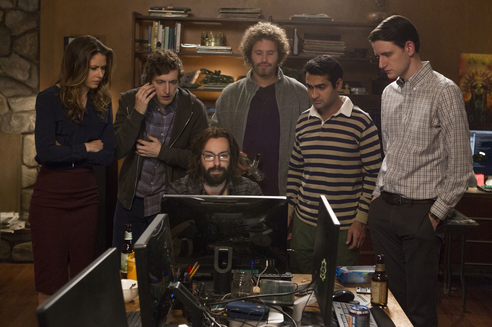
<i>Сериал "Кремниевая долина" (2014)</i>

---

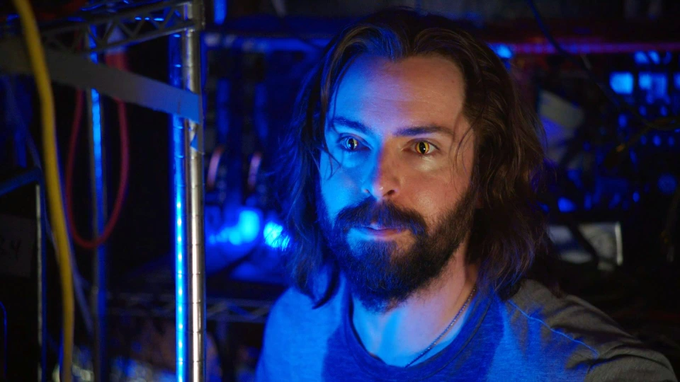
<i>Сериал "Кремниевая долина" (2014)</i>

---

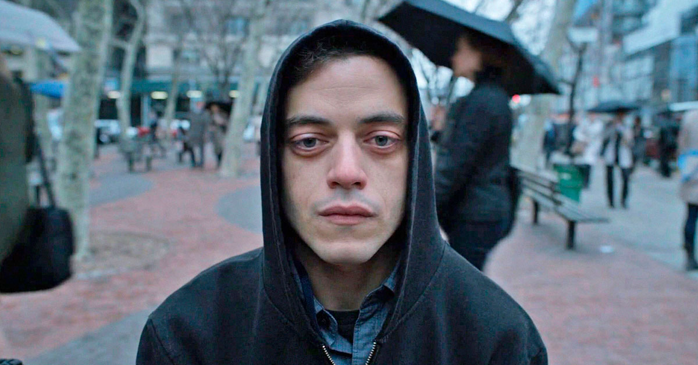
<i>Сериал "Мистер Робот" (2015)</i>

---

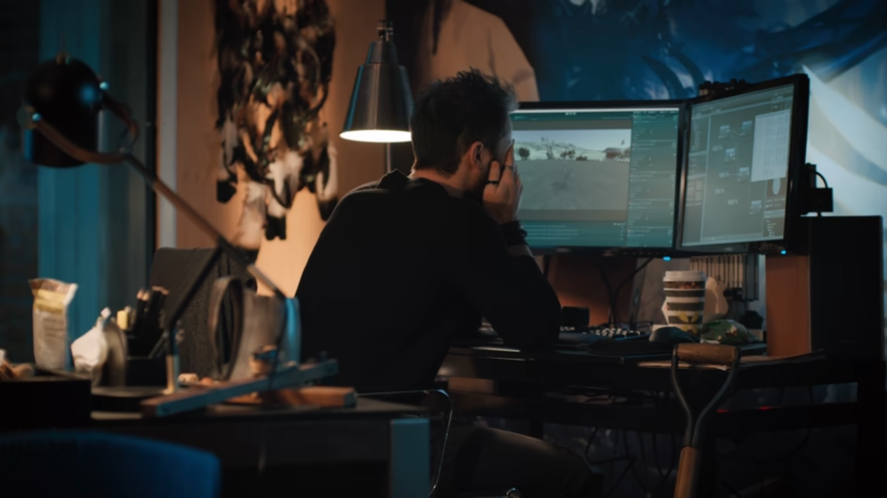
<i>Сериал "Мистический квест" (2020)</i>

---

<i>Сериал "Мистический квест" (2020)</i>

---
layout: statement
---

# Что-то общее, да? 

---

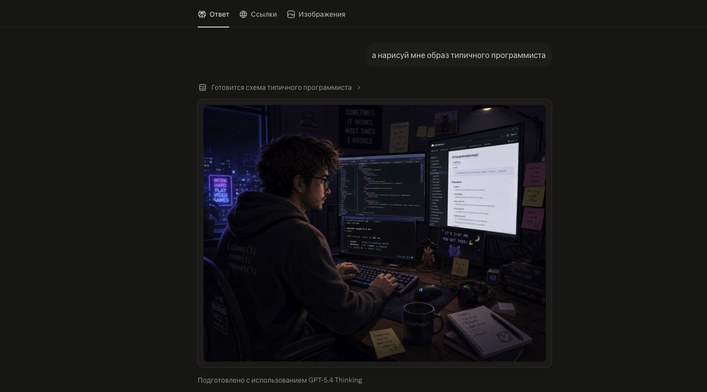
<i>Как видит программиста GPT-5.4</i>

---

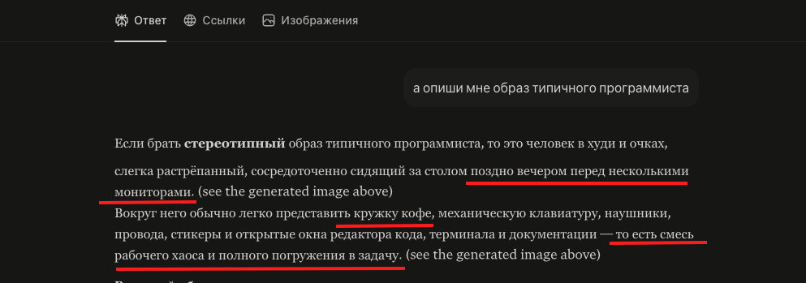
<i>Как описывает программиста GPT-5.4</i>

---
layout: image-right
image: assets/before.png
---

# Типичный образ
## 

<v-clicks>

* Темнота за окном
* Темнота под глазами
* Кофе
* Тащер

</v-clicks>

<v-click>
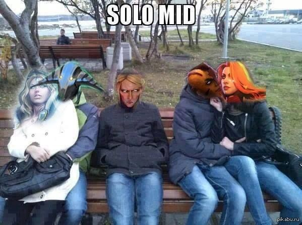
</v-click>

---
layout: image-right
image: assets/remote.png
---

<v-click>

# Удалёнка не создала трудоголизм

</v-click>

<v-click>

## Она усилила то, что уже было

</v-click>

<v-clicks>

* Те, кто и раньше умел отлынивать, просто стали делать это удобнее
* Те, кто и раньше перерабатывал, стали работать ещё больше
* Дома исчезла граница между “я живу” и “я ещё чуть-чуть доделаю”
* “work from home” легко мутирует в “live at work”

</v-clicks>

---
layout: statement
---

# Что говорит наука

